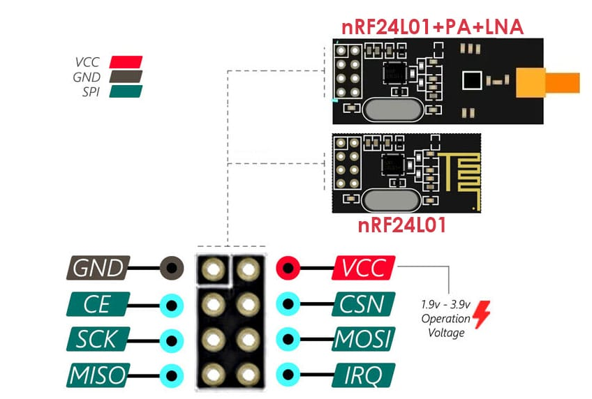
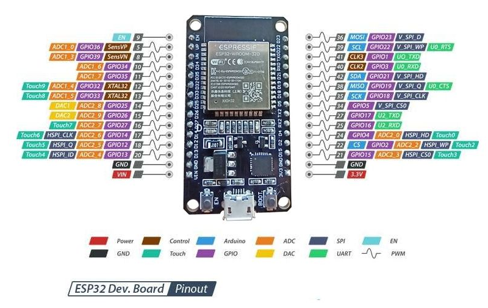

# Jammer Bluetooth e Wifi 2.4Ghz

Este é um Documento para criação de um Jammer 2.4GHz bluetooth e wifi com dois módulos nRF24L01 controlados por um ESP32S WROOM Tipo C Com suporte a wifi e bluetooth.

Esse projeto foi resultado de várias buscas em repositórios e adaptações para a minha realidade.

----

## Materiais

1) ESP32S WROOM
2) Módulo nRF24L01 (2 unidades)
3) Jumpers Femea para Fêmea
4) 2 Capacitores Eletrolíticos 10v 100µF
5) Arduino IDE

> Obs.: O ESP32S que vamos utilizar só tem uma saída 3V3 portanto será compartilhada entre os dois módulos nRF24L01. Portanto faremos um jumper personalizado de uma saída 3V3 para 2 saídas 3V3. Só emendar os 3. Mas isso só pra os testes iniciais, depois que for montar a placa não será necessário.

----

## Passo-a-passo

### Módulos

Em cada módulo nRF24L01 você terá 8 pinos, geralmente a placa é etiquetada, caso não sejaa ordem dos pinos é da seguinte forma:



Você irá soldar por trás de cada módulo 1 capacitor eletrolítico de 10v e 100µF com o positivo no VCC e o negativo no GND (muita atenção aqui, não quero que você se exploda)

----

### Conexões

Módulo 1 (HSPI)

| NRF24L01 | ESP32 GPIO |
| -------- | ---------- |
| CE       | GPIO16     |
| CSN      | GPIO15     |
| SCK      | GPIO14     |
| MISO     | GPIO12     |
| MOSI     | GPIO13     |
| VCC      | 3V3        |
| GND      | GND        |


Módulo 2 (VSPI)

| NRF24L01 | ESP32 GPIO |
| -------- | ---------- |
| CE       | GPIO22     |
| CSN      | GPIO21     |
| SCK      | GPIO18     |
| MISO     | GPIO19     |
| MOSI     | GPIO23     |
| VCC      | 3V3        |
| GND      | GND        |

Eu tive muito problema porque não li a documentação da minha ESP32S WROOM e por isso não entendia onde ficava o pino 16, por exemplo...

então é simples, vou deixar abixo o diagrama da placa ESP32S WROOM:

Em cima...

| Rótulo na placa | GPIO real | Uso recomendado      |
| --------------- | --------- | -------------------- |
| GND             | GND       | Terra do circuito    |
| D13             | GPIO 13   | MOSI (HSPI)          |
| D12             | GPIO 12   | MISO (HSPI)          |
| D14             | GPIO 14   | SCK (HSPI)           |
| D27             | GPIO 27   | livre (CE / CSN)     |
| D26             | GPIO 26   | livre                |
| D25             | GPIO 25   | livre                |
| D33             | GPIO 33   | livre                |
| D32             | GPIO 32   | livre                |
| D35             | GPIO 35   | **somente entrada**  |
| D34             | GPIO 34   | **somente entrada**  |

Em baixo...

| Rótulo na placa | GPIO real | Uso recomendado                    |
| --------------- | --------- | ---------------------------------- |
| 3V3             | 3.3V      | Alimentação nRF24L01               |
| GND             | GND       | Terra do circuito                  |
| D15             | GPIO 15   | cuidado (boot pin), mas utilizável |
| D2              | GPIO 2    | cuidado no boot (mantê-lo LOW)     |
| D4              | GPIO 4    | **livre e ótimo para CE / CSN**    |
| RX2             | GPIO 16   | pode usar como GPIO                |
| TX2             | GPIO 17   | pode usar como GPIO                |
| D5              | GPIO 5    | **ótimo para CSN**                 |
| D18             | GPIO 18   | SCK (VSPI)                         |
| D19             | GPIO 19   | MISO (VSPI)                        |
| D21             | GPIO 21   | **ótimo para CE / CSN**            |
| RX0             | GPIO 3    | RX serial — **evite usar**         |
| TX0             | GPIO 1    | TX serial — **evite usar**         |
| D22             | GPIO 22   | ótimo                              |
| D23             | GPIO 23   | MOSI (VSPI)                        |




Siga a tabela acima e tudo ficará bem.

----

### Arduino IDE

Bom... existe uma série de coisas que você precisará fazer antes de qualquer coisa no seu Arduino IDE

1) Baixe a IDE do arduino (óbvio). Veja como fazer para o seu sistema operacional
2) Vá até File > Preferences e onde tiver "Additional boards manager URLs" adicione a url abaixo:

```
https://raw.githubusercontent.com/espressif/arduino-esp32/gh-pages/package_esp32_index.json
```

3) Após adicionar e clicar em OK, espere atualizar os gerenciadores de placas.
4) Vá até Tools > Board: > Boards Manager... e na pesquisa digite "esp32".
5) Instale "esp32 by Espressif Systems" (aguarde instalar). 
6) Vá até Tools > Board: > esp32 e depois selecione "ESP32-WROOM-DA Module".
7) Vá até Tools > Manage Libraries... e na pesquisa digite "rf24".
8) Instale "RF24 by TMRh20" (aguarde instalar).
9) Vá em File > Open... e abra o arquivo jammer_2.4ghz_bluetooth_wifi.ino
10) Conecte a sua ESP32S WROOM ao USB do seu computador
11) Vá até Tools > Port e selecione a porta onde está a sua placa
12) Vá até Sketch > Verify/Compile
13) Por fim vá até Sketch > Upload

Se tudo correr bem, você terá instalado e rodando o seu Jammer 2.4Ghz.


## Aviso!

É claro que você já sabe que esse é um dispositivo que deve ser usado somente em caráter EDUCACIONAL e jamais deve ser utilizado como ferramenta para lesar o seu próximo. Portanto, fica proibida a utilização deste código para fins não-educacionais.